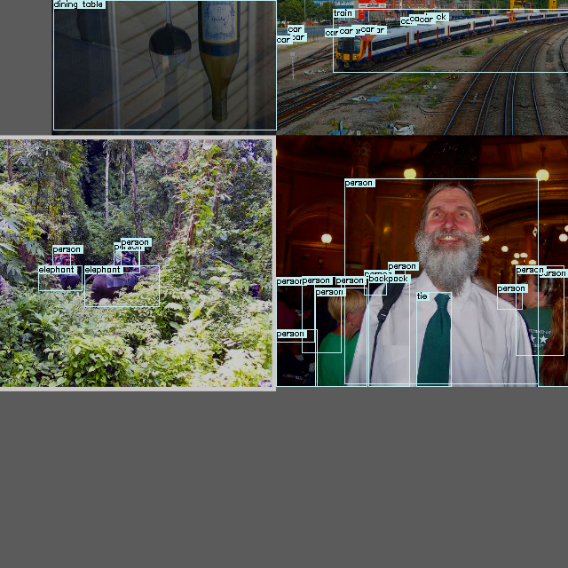
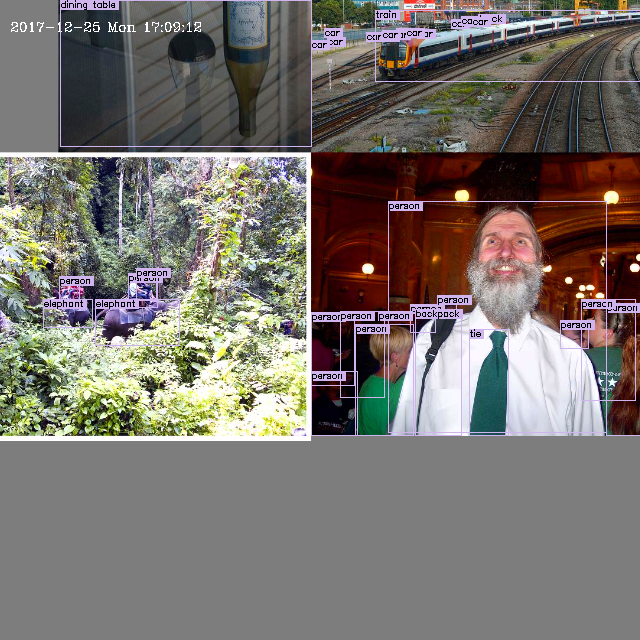
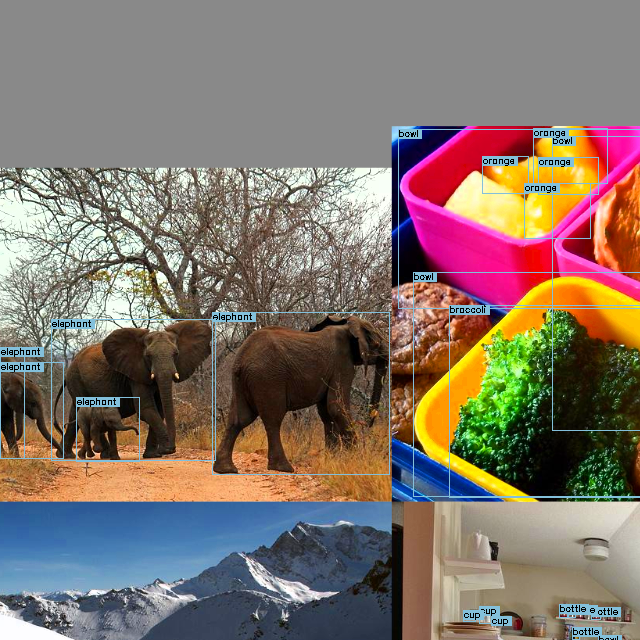
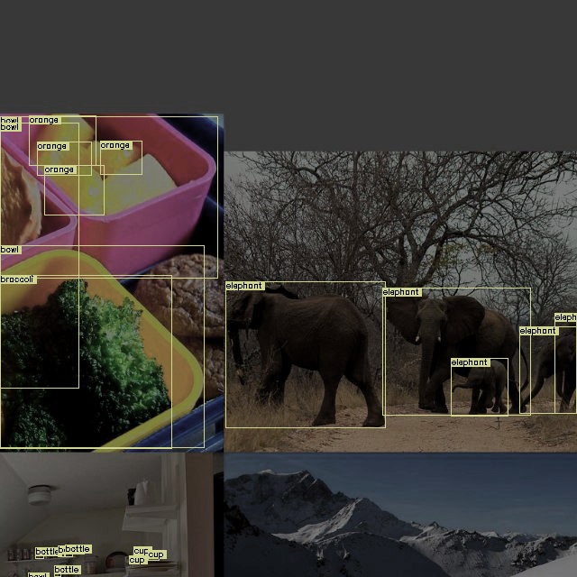

## Get Started
```python
from arch.control_unit.detection_training_control import DefaultSettings, TrainingControlUnit
from arch.model.object_detection.yolov5 import yolov5s, yolov5n

if __name__ == "__main__":
    DefaultSettings.trainset_path = "../datasets/coco/train2017.txt"
    DefaultSettings.valset_path = "../datasets/coco/val2017.txt"

    settings = DefaultSettings()
    settings.save_dir = "runs/yolov5s"
    model = yolov5s(num_classes=80)
    TrainingControlUnit(model, settings).run(device="0")

    settings = DefaultSettings()
    settings.save_dir = "runs/yolov5n"
    model = yolov5n(num_classes=80)
    TrainingControlUnit(model, settings).run(device="0")
```

training can be excecuted in queue with this control unit.

as shown above, you can set `DefaultSettings` as global setting, and adjust each settings instance further.


## Evaluation Only

to evaluate only, set `DEBUG_VALIDATION_ONLY = True`.

```python
    ...
    tcu = TrainingControlUnit(model, settings)
    tcu.DEBUG_VALIDATION_ONLY = True  # set this line
    tcu.run(device="cpu")
```

## Quick Debug Mode

to check trainer quickly, set `FAST_DEBUG_MODE = True` to skip n-1 iters each epoch.

```python
    ...
    tcu = TrainingControlUnit(model, settings)
    tcu.FAST_DEBUG_MODE = True  # set this line
    tcu.run(device="cpu")
```

## Augmentation Settings

you can adjust augmentations in both `DefaultSettings` or source code in `utils/yolov5_dataset_loader_pack/augmentations.py` & `utils/yolov5_dataset_loader_pack/datasets.py`.

all augmentation details and args are shown as below.

### mosaic


### mixup

```
Notice: only used for large models in u-yolov5 repository.
```

### degrees, translate, scale, shear, perspective (random affine)

```
degrees: image rotation (+/- deg)
translate: image translation (+/- fraction)
scale: image scale (+/- gain)
shear: image shear (+/- deg)
perspective: image perspective (+/- fraction), range 0-0.001
```
### copy_paste


### augment_hsv


### fake_osd
`training_utils.yolov5_dataset_loader_pack.augmentations.py:290`:
|  |  |
| -- | -- |
| fake_osd off | fake_osd on |


### fake_darkness
`training_utils.yolov5_dataset_loader_pack.augmentations.py:34`:

```python
    if fake_darkness:
        T.extend(
            [
                A.RandomGamma(p=0.01),
                A.ColorJitter(brightness=(0.1, 0.5), p=0.5),
                A.ImageCompression(quality_lower=75, p=0.5),
            ]
        )
```

|  |  |
| -- | -- |
| fake_darkness off | fake_darkness on |