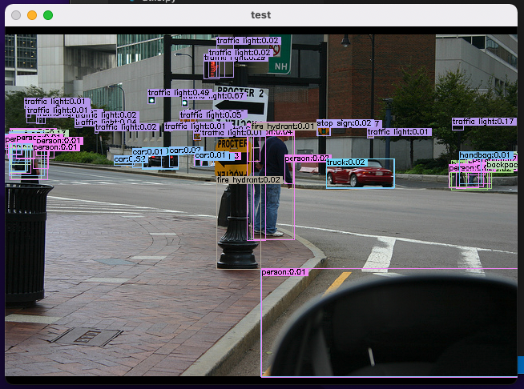

## yolov5_ultralytics
https://github.com/ultralytics/yolov5
官网yolov5n/yolov5s的重新实现，离线并简化了部分训练代码
### Tests
---
2022/6/14 一致性测试：

导入u版yolov5n权重测试，结果如下：

## yolov5_ghost
在u版yolov5的基础上提换c3模块为ghost模块，params/flops均有减轻

## yolov5_vovnet
替换backbone为vovnet，params极小，flops很大，或许可作特殊场景使用

## todo list
---
1. repvgg: https://zhuanlan.zhihu.com/p/410874403
2. yolov5-lite: https://zhuanlan.zhihu.com/p/400545131
3. ppogg/yolov5-lite: https://github.com/ppogg/YOLOv5-Lite
