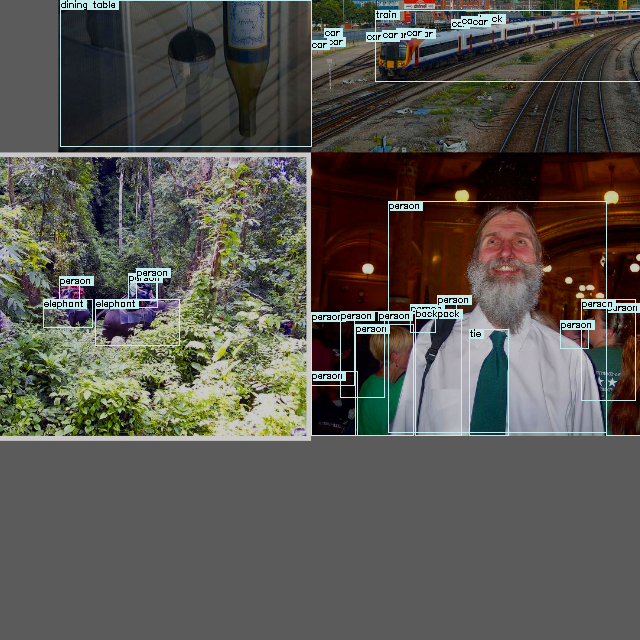
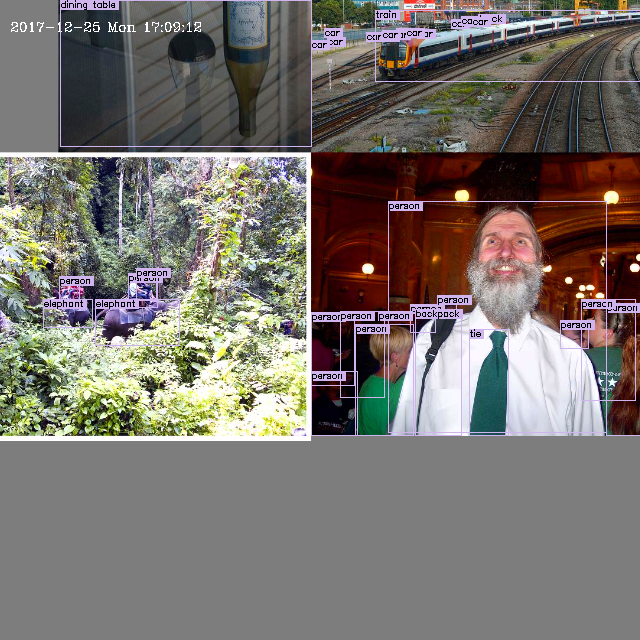
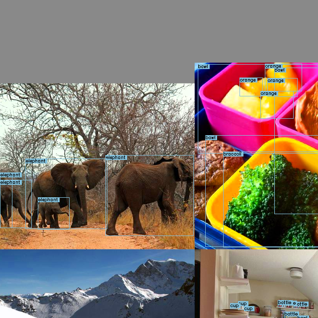
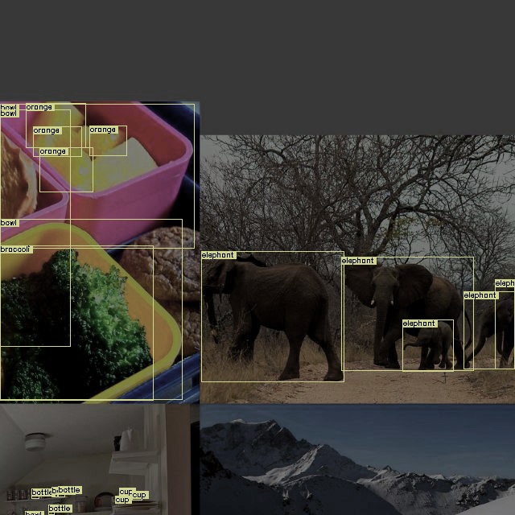

## Augmentation Settings

### mosaic


### mixup

```
Notice: only used for large models in u-yolov5 repository.
```

### degrees, translate, scale, shear, perspective (random affine)

```
degrees: image rotation (+/- deg)
translate: image translation (+/- fraction)
scale: image scale (+/- gain)
shear: image shear (+/- deg)
perspective: image perspective (+/- fraction), range 0-0.001
```
### copy_paste


### augment_hsv


### fake_osd
`training_utils.yolov5_dataset_loader_pack.augmentations.py:290`:
|  |  |
| -- | -- |
| fake_osd off | fake_osd on |


### fake_darkness
`training_utils.yolov5_dataset_loader_pack.augmentations.py:34`:

```python
    if fake_darkness:
        T.extend(
            [
                A.RandomGamma(p=0.01),
                A.ColorJitter(brightness=(0.1, 0.5), p=0.5),
                A.ImageCompression(quality_lower=75, p=0.5),
            ]
        )
```

|  |  |
| -- | -- |
| fake_darkness off | fake_darkness on |